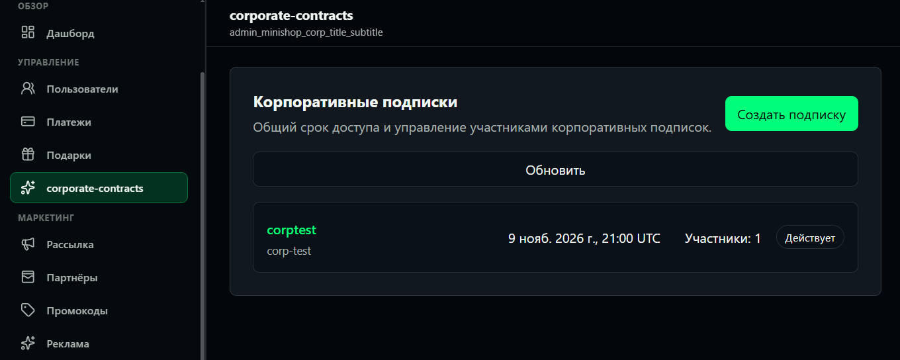
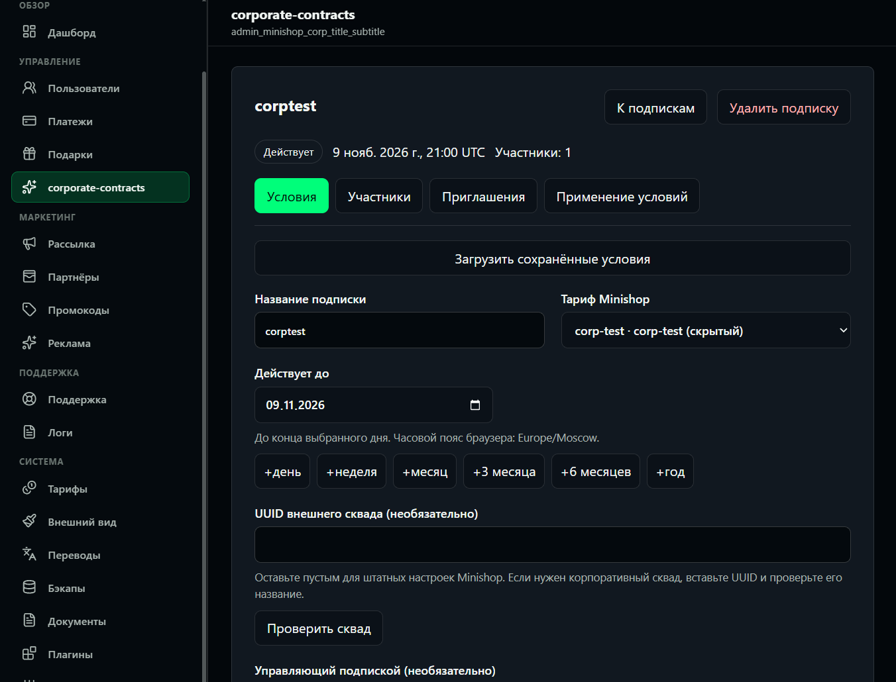
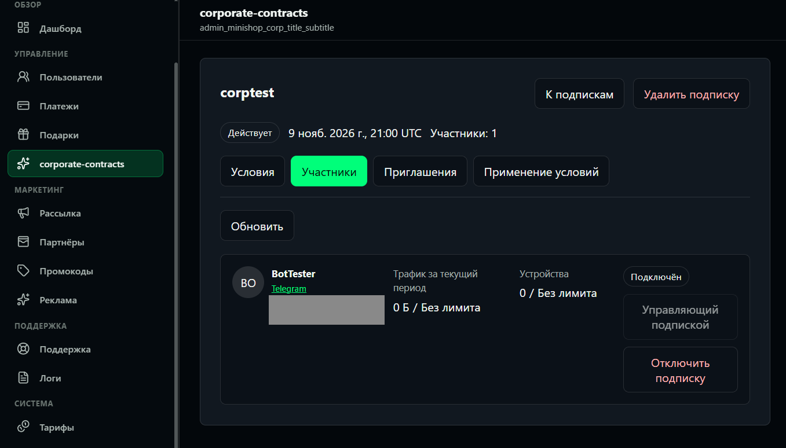
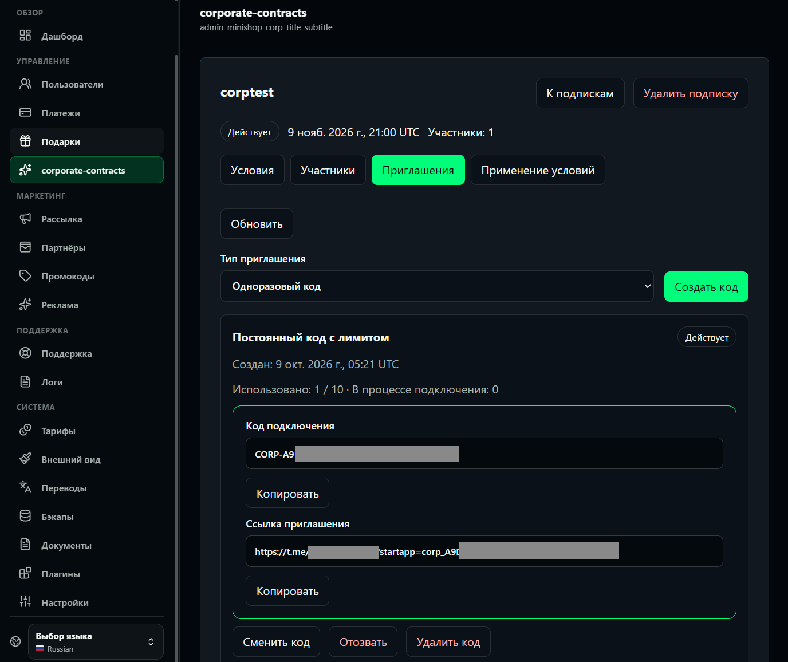
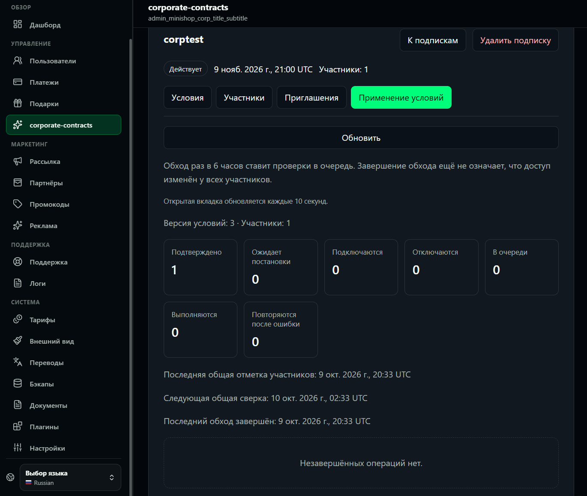
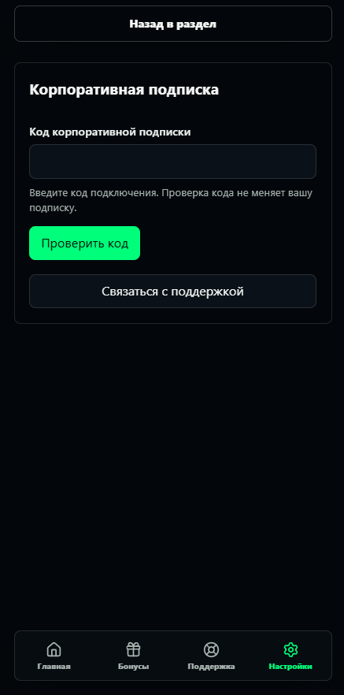
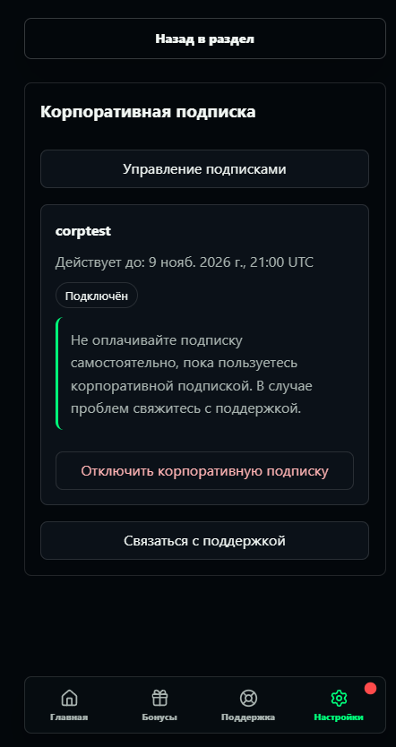
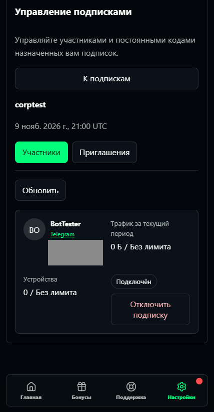
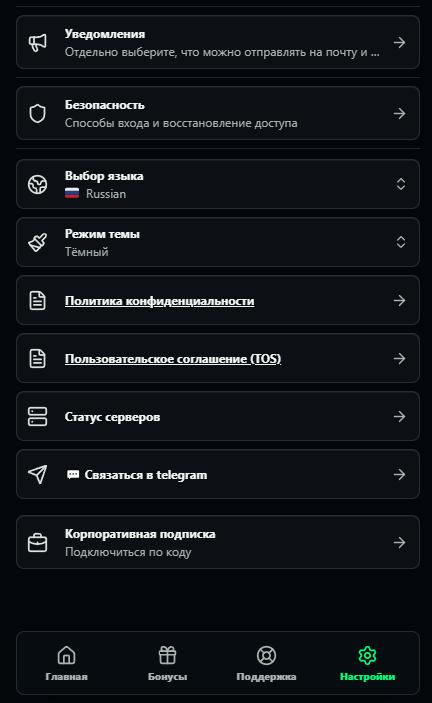
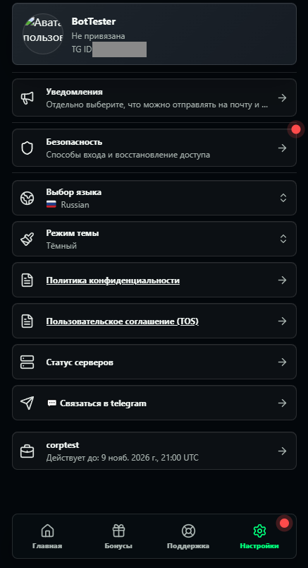

# minishop-corp

Корпоративные подписки для **Remnawave Minishop**. Организация оплачивает услугу вне
бота, администратор задаёт тариф и общий срок, а сотрудники подключаются по приглашению.

## Возможности

- Одноразовые приглашения и постоянные коды с лимитом успешных вступлений.
- Управление подписками, приглашениями и участниками из админки Minishop.
- Кабинет управляющего с профилями, трафиком, устройствами и исключением участников.
- Подключение и выход через раздел настроек Mini App, интерфейс на русском и английском.
- Применение изменений ко всей группе и общая сверка срока раз в 6 часов.
- Новый стандартный триал после выхода или исключения; безопасные повторы операций.

Внешний сквад и управляющий необязательны. Истечение подписки сохраняет группу;
продление возвращает доступ без повторного приглашения. Штатное удаление аккаунта
поддерживается и при выключенном плагине.

## Совместимость

Текущая версия — **0.1.6**. Проверенная база — **Minishop 3.8.1**, Linux x86_64,
Python 3.12, Plugin API 1 и frontend host API 1. Ревизия ядра закреплена в
[dev/minishop.json](dev/minishop.json). Совместимость с другими версиями Minishop
не заявляется; работу с Remnawave обеспечивает сам Minishop.

Аккаунты с действующими или будущими гибкими квотами `FlexibleTrafficLimit`
не поддерживаются. При вступлении личный тариф и срок заменяются корпоративными;
остаток оплаченных дней не переносится. Подробнее — в [требованиях](docs/specification.md)
и [инструкции эксплуатации](docs/installation.md).

## Установка

В админке Minishop откройте **Плагины**, выберите установку из репозитория и укажите
[https://github.com/deadcxap/minishop-corp](https://github.com/deadcxap/minishop-corp).
Minishop найдёт и скачает подписанный пакет; останется подтвердить установку
и включить плагин.

Это работает после первого успешного запуска публикации в Actions. Для собственного
репозитория один раз настройте ключ издателя и права workflow по
[инструкции сборки](docs/ci-packaging.md). Установка, обновление и эксплуатация — в
[руководстве](docs/installation.md).

## Скриншоты

Нажмите на изображение, чтобы открыть его в полном размере.

### Панель администратора

[](docs/screenshots/admin-subscriptions.png)

<details>
<summary>Условия подписки, участники, приглашения и применение изменений</summary>

**Условия подписки** — тариф, общий срок и внешний сквад.

[](docs/screenshots/admin-subscription-settings.png)

**Участники** — профили, трафик, устройства и управление доступом.

[](docs/screenshots/admin-members.png)

**Приглашения** — коды, ссылки и лимиты подключений.

[](docs/screenshots/admin-invitations.png)

**Применение условий** — состояние операций и общая сверка участников.

[](docs/screenshots/admin-reconciliation.png)

</details>

### Mini App

<table>
  <tr>
    <th width="33%">Подключение по коду</th>
    <th width="33%">Корпоративная подписка</th>
    <th width="33%">Кабинет управляющего</th>
  </tr>
  <tr>
    <td align="center" valign="top">
      <a href="docs/screenshots/customer-join.png"></a>
    </td>
    <td align="center" valign="top">
      <a href="docs/screenshots/customer-membership.png"></a>
    </td>
    <td align="center" valign="top">
      <a href="docs/screenshots/manager-members.png"></a>
    </td>
  </tr>
</table>

<details>
<summary>Вход в раздел из настроек Mini App</summary>

<table>
  <tr>
    <th width="50%">До подключения</th>
    <th width="50%">С активной подпиской</th>
  </tr>
  <tr>
    <td align="center" valign="top">
      <a href="docs/screenshots/customer-settings.png"></a>
    </td>
    <td align="center" valign="top">
      <a href="docs/screenshots/customer-settings-connected.png"></a>
    </td>
  </tr>
</table>

</details>

## Документация

- [Требования и критерии приёмки](docs/specification.md).
- [Текущее состояние и оставшиеся задачи](docs/implementation-plan.md).
- [Администратор магазина](docs/admin-ui.md), [участник и управляющий](docs/customer-ui.md).
- [Совместимость и ограничения](docs/minishop-compatibility.md), [диагностика](docs/logging.md).
- [Разработка и проверки](CONTRIBUTING.md), [локальное окружение](docs/development.md).
- [Сборка пакета](docs/ci-packaging.md), [покрытие требований тестами](docs/acceptance.md).
- API: [контракты](docs/contracts-api.md), [приглашения](docs/invitations.md),
  [членство](docs/membership-api.md), [участники](docs/members-api.md),
  [сверка](docs/reconciliation.md).
- [Хранилище](docs/storage.md), [удаление аккаунтов](docs/account-deletion.md).

## Лицензия

[Unlicense](LICENSE).

## На токены автору

Если плагин экономит вам время, можно подкинуть автору на токены.
Кофе он ещё сварит сам, а нейросеть в долг не думает ☕

**GRAM · сеть TON**

```text
UQAW7M3NlFZEAMF8Ei3lXTOz-FMsrcZNrJvRcyDvF0oGYimG
```

**USDT · сеть TRC20**

```text
TE8JtteH2yy82CPqRPgAGSfgL2oXqauVk1
```
